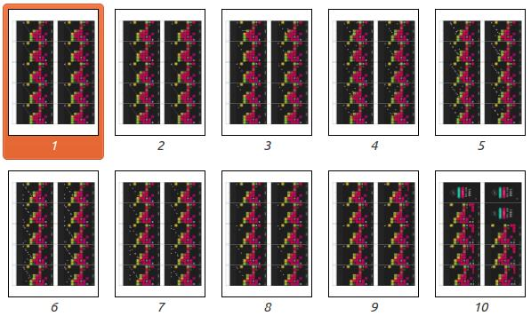

# flipbook

Create a flipbook from a video (using opencv, reportlab and python)

## Dependencies

- Reportlab (for writing pdf's)
- OpenCV (for reading and manipulating images)

## Usage

```
usage: flipbook_from_video.py [-h] [--fps FPS] [--dpi DPI]
                              [--num-cols NUM_COLS] [--output OUTPUT]
                              [--padding-left PADDING_LEFT]
                              [--margin-x MARGIN_X] [--margin-y MARGIN_Y]
                              video

positional arguments:
  video                 Input video for the flipbook

optional arguments:
  -h, --help            show this help message and exit
  --fps FPS             How many frames (images) per second of video
  --dpi DPI             How many pixels per inch
  --num-cols NUM_COLS   How many columns
  --output OUTPUT       Output PDF filename
  --padding-left PADDING_LEFT
                        Padding in inches from the left
  --margin-x MARGIN_X   Margin x around page in inches
  --margin-y MARGIN_Y   Margin y around page in inches
```

## Example output


